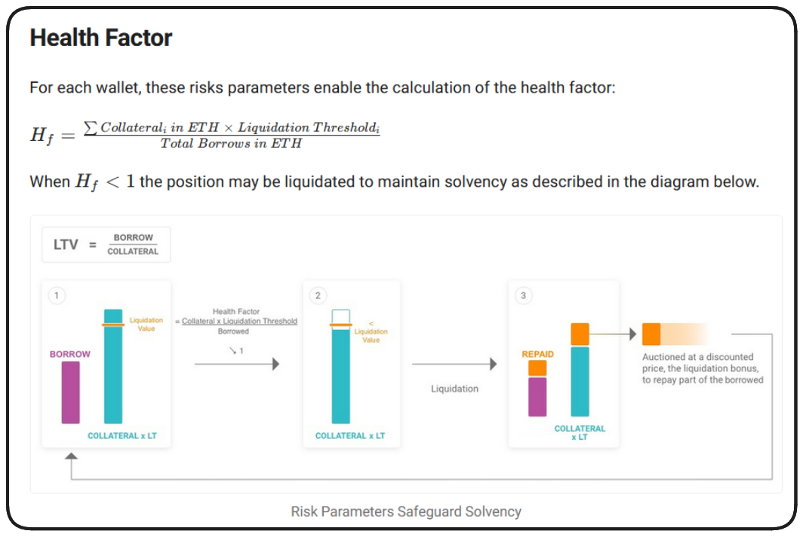

# What is DeFi?

DeFi (Decentralized Finance) is a system where financial services are done on blockchain, without banks or middlemen. Everything is peer-to-peer and controlled by smart contracts (programs on blockchain that run automatically).

| Feature      | Normal Finance (CeFi)                  | DeFi                                           |
| ------------ | -------------------------------------- | ---------------------------------------------- |
| Control      | Banks or financial institutions        | Users control their money directly             |
| Intermediary | Required (banks, brokers)              | No intermediaries, smart contracts do the work |
| Access       | Limited by country, account, or credit | Anyone with internet & crypto wallet           |
| Transparency | Transactions are mostly private        | Blockchain is public and transparent           |
| Speed        | Slow (depends on bank timings)         | Fast, 24/7, no holidays                        |
| Costs        | High fees for cross-border transfers   | Low fees (depends on blockchain network)       |


# What we can do in DeFi:

## Lending & Borrowing:
   Lend crypto to earn interest.
   Borrow crypto by giving extra crypto as collateral.
## Trading:
   Swap one crypto for another directly, no bank needed.

## Yield Farming:
   Earn rewards by putting your crypto in pools that help platforms work.
## Insurance:
   Protect your crypto from hacks or losses by paying a small fee.


# Problems with Existing Cryptocurrencies
 ## Price Volatility:
   Cryptos like Bitcoin and Ethereum change value very fast.
  Example: BTC can go up or down 10% in a single day.
  Makes them hard to use for payments, trading, or loans.
 ## Not Reliable for Daily Transactions:
   If you pay with BTC today, its value could drop tomorrow.
   People can lose money unintentionally.
 ## Difficult for Lending & Borrowing:
   Lenders risk losing value if crypto prices drop.
   Borrowers need to deposit extra collateral due to volatility.
 ## Limited Adoption for Businesses:
   Businesses don’t want to accept crypto that keeps changing value.
   Hard to use for salaries, payments, or savings.


# ✅ Why Stablecoins Solve This:
  Stablecoins are pegged to real money (like USD) → value stays stable.
  They allow safe payments, trading, lending, and borrowing in DeFi.
  Reduce the risk of losing money due to crypto price swings.

  # What is Stable coins
  A stable coin is a crypto asset whose buying power stays relatively stable. Unlike bitcoin or ethereum the value does not swing up or down so much


# Examples:
## 1
Imagine Alice wants to pay for her groceries with crypto:
She owns 1 ETH.
Today, 1 ETH = $2,000 → enough to buy groceries.
Tomorrow, ETH crashes to $1,500 → now her grocery payment lost $500 in value.
💡 Problem: Cryptos like ETH, BTC are too volatile for everyday payments or savings.
Now, if Alice uses a stablecoin (like USDC or your stablecoin):
1 stablecoin = $1, always.
She pays $50 worth of stablecoins → value stays $50 regardless of market swings.

## 2
🔹 Step 1: Deposit Collateral → Mint Stablecoin
Alice has 1 ETH = $2,000.
She wants to mint stablecoins.
Rule: System requires 150% collateral ratio (safety margin).
So with $2,000 ETH, Alice can mint up to $1,333 stablecoins.
Why not full $2,000? → To protect against ETH price drops.

🔹 Step 2: Use Stablecoins
Alice spends or invests her 1,333 stablecoins.
These stablecoins stay pegged to $1 each because they are backed by ETH collateral.

🔹 Step 3: Repay & Burn
Later, Alice wants her ETH back.
She must repay 1,333 stablecoins + small interest/fee.
Smart contract burns those stablecoins.
Alice gets back her 1 ETH collateral.

🔹 Step 4: What if ETH Price Drops? (Liquidation)
Suppose ETH falls from $2,000 → $1,500.
Alice’s collateral = $1,500.
But her debt = $1,333 stablecoins.
Now collateral ratio = 112%, below the safe limit (150%).
This is risky → system must act!

🔹 Step 5: Liquidation (How Others Profit)
The protocol opens liquidation.
Another user (Bob) can pay Alice’s debt of 1,333 stablecoins.
In return, Bob gets Alice’s ETH at a discount (say 5–10%).
Example: Bob repays 1,333 stablecoins and gets $1,400 worth of ETH.
Bob makes $67 profit, and system stays safe.

🔹 Why This Works
Alice’s debt is cleared (stablecoins burned).
Bob makes profit by buying discounted ETH.
System stays stable because every stablecoin in circulation is still fully backed by collateral.
✅ Summary in Simple Words:
Deposit collateral → Mint stablecoins.
Repay stablecoins → Get collateral back.
If collateral drops too much → Liquidation happens.
Other users repay the debt and earn profit from collateral discount.
This keeps the stablecoin safe and always pegged near $1.

  # categories and properties
   *** Relative stability ***
   *** stablity Method ***
   *** collateral type ***

## Relative stability 
  ### Pegged/Anchored Stablecoins :
     value is tied to something else, usually the us dollar
     ex: USDC ,USDT , DAI
  ### Floating 
   Not pegged to one asset instead algorithms keep their buying power steady overtime 
   ex:RAI not pegged but tries to keep its value stable with some math

## Stability Method 
 ### Governed : 
  humans or organiztion decide when coins are creasted (minted) or destoryed (burned)
  ex: USDC USDT (circle and tether control them)
 ### Algorithmic :
 controlled by code not the people 
 algorithm automatically mint / burn coin to keep value stable
 ex: UST ,DAI

 ## Collateral Type
  collateral mean swhat backs the stable coin
  ### Exogenous collateral
   outside assets , backed by real world money or external assests 
   ex: usdc -> backed buy real dollar bank 
   if usdc fails the us dollar is itill fine
   DAI -> backed by ETH & other cryptocurriences
 ### Endogenous collateral (inside the system)
  backed by tokens created inside the same protocol
   ex :ust was backed by LUNA - when UST fails LUNA fails too


# Top Stable coins
 1. DAI -> pegged algorithmic and exo
 2. USDC -> pegged governed and exo
 3. UST & LUNA -> pegged algo endo
 4. FRAX ->pegged algo hybrid
 5. RAI -> floating Algo exo


# Design of Stable coin we are going to create
1. Relative Stability: Anchored or Pegged to the US Dollar
   Chainlink Pricefeed
   Function to convert ETH & BTC to USD
2. Stability Mechanism (Minting/Burning): Algorithmicly Decentralized
   Users may only mint the stablecoin with enough collateral
3. Collateral: Exogenous (Crypto)
   wETH
   wBTC


# Working
User deposits collateral (wETH / wBTC) → collateral is locked in the protocol.
User mints stablecoins up to a safe collateralization ratio (e.g., 150%).
Stablecoins circulate — user can spend, lend, or provide liquidity.
Protocol constantly checks collateral ratio using Chainlink price feeds.
If ratio falls below liquidation threshold (e.g., 120%) → protocol allows liquidation.
Liquidator repays debt (stablecoins) and receives collateral at a discounted price (liquidation bonus).
Stablecoins used to repay debt are burned. Collateral transferred to liquidator.
If user repays full debt + fees, they call burn & withdraw → stablecoins burned, collateral released.

| Total collateral (USD) | Collateral % (threshold) | Debt you’re allowed |
| ---------------------- | ------------------------ | ------------------- |
| \$10,000               | 80%                      | \$8,000             |
| \$10,000               | 60%                      | \$6,000             |
| \$10,000               | 90%                      | \$9,000             |


# Token
A token is just a digital asset created on top of a blockchain.
It isn’t the main coin of that blockchain — instead, it’s made with smart contracts.

## ERC

ERC = Ethereum Request for Comment.

It’s a proposal that defines how smart contracts should behave so that wallets, DEXs, and other dApps can interact with them consistently.

Once approved by the community, it becomes a formal Ethereum standard.

Think of ERCs like USB specifications for hardware: if everyone follows the same plug standard, everything works together.

## Main erc standards
| ERC          | Purpose                                          | Examples               |
| ------------ | ------------------------------------------------ | ---------------------- |
| **ERC-20**   | Fungible tokens (all units are interchangeable). | USDC, DAI, LINK        |
| **ERC-721**  | Non-fungible tokens (NFTs, unique IDs).          | CryptoPunks, Bored Ape |
| **ERC-1155** | Multi-asset contract (can hold fungible + NFTs). | Game items (Enjin)     |
| **ERC-4626** | Tokenized vaults/yield-bearing assets.           | Yearn vault shares     |
| **ERC-777**  | Advanced fungible token (hooks, operator model). | Some DeFi tokens       |

 

# Relationship between stable coin and erc20

1️⃣ A stablecoin is just a token
On Ethereum, stablecoins aren’t special coins built into the blockchain — they’re smart contracts that track who owns how many units.

To make them work everywhere, developers build them as ERC-20 tokens.

2️⃣ ERC-20 = a shared rulebook

ERC-20 defines a few basic functions every wallet and app understands:

balanceOf(address) → check how many tokens someone owns

transfer(address, amount) → send tokens

approve(spender, amount) & transferFrom() → let apps move your tokens with permission

If you follow these rules, any ERC-20 wallet or exchange can read balances and send your token without extra coding.

3️⃣ Stablecoin-specific logic

On top of ERC-20’s basic rules, the contract adds:

Mint → create new tokens when someone deposits dollars/crypto

Burn → destroy tokens when someone redeems

Collateral checks / price oracles → keep value close to $1

So the “stable” part is just extra code — the token interface stays standard.

4️⃣ Why that matters

Your token automatically works with:

Wallet apps (MetaMask, Coinbase Wallet)

DEXs (Uniswap, Curve)

Lending protocols (Aave, Compound)

Payment gateways

No one has to write a custom integration for your stablecoin.

5️⃣ Without ERC-20

If you invented your own custom interface, every wallet/exchange would need to learn it first — most wouldn’t bother.

Adoption would be slow or impossible.

# CodeFlow
## DecentralizedStableCoin.sol
  It consist of two functions mint and burn function to burn and mint the token
## DSCEngine
  *** constructor ***: The DSC Engine constructor takes the arry of token  address (address of collateral token (wetgh and wbtc)) and their priceFeeds and address of dsc
  *** Functions ***
  1. depositCollateral : 
      - It takes token address and amount to be keep as collateral
      - It transfers token collateral from the msg.sender to our contract address
      - this way msg.sender deposit collateral to contract
  2. mintDsc : 
      - amountDscToMint The amount of DSC you want to mint . You can only mint DSC if you have  enough collateral
      - It takes amountDscToMint 
      - we check revert if healthfactor is low using ***_revertIfHealthFactorIsBroken(msg.sender)*** of msg.sender
   


   
  
# Important topics 
 

 ## liquidation working 
 User deposited $100 in collateral and mints $50 in DSC

Collateral value falls to $75, breaking the user's Health Factor (0.75)

A liquidator burns $50 in DSC to close the position

The liquidator is rewarded $75 in collateral

The liquidator has profited $25

## openzeppelin
 *** https://github.com/OpenZeppelin/openzeppelin-contracts ***
 to install in foundry
```forge install openzeppelin/openzeppelin-contracts```
## chainlink orcale 
 ```forge install smartcontractkit/chainlink-brownie-contracts@latest```

# Foundry

**Foundry is a blazing fast, portable and modular toolkit for Ethereum application development written in Rust.**

Foundry consists of:

-   **Forge**: Ethereum testing framework (like Truffle, Hardhat and DappTools).
-   **Cast**: Swiss army knife for interacting with EVM smart contracts, sending transactions and getting chain data.
-   **Anvil**: Local Ethereum node, akin to Ganache, Hardhat Network.
-   **Chisel**: Fast, utilitarian, and verbose solidity REPL.

## Documentation

https://book.getfoundry.sh/

## Usage

### Build

```shell
$ forge build
```

### Test

```shell
$ forge test
```

### Format

```shell
$ forge fmt
```

### Gas Snapshots

```shell
$ forge snapshot
```

### Anvil

```shell
$ anvil
```

### Deploy

```shell
$ forge script script/Counter.s.sol:CounterScript --rpc-url <your_rpc_url> --private-key <your_private_key>
```

### Cast

```shell
$ cast <subcommand>
```

### Help

```shell
$ forge --help
$ anvil --help
$ cast --help
```
